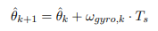
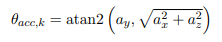

# Roll and Pitch Estimation using Extended Kalman Filter

A real-time attitude estimation system that uses an Extended Kalman Filter (EKF) to estimate roll and pitch angles from IMU sensor data. The system combines ESP32 microcontroller with LSM9DS1 IMU for data acquisition and ROS2 for processing and visualization. This project was a **course project** submission for the course **SC-651(prof. Ravi Banavar)**

## Overview

This project implements a sensor fusion algorithm that combines accelerometer and gyroscope data to provide accurate roll and pitch angle estimates. The Extended Kalman Filter is used to optimally combine the high-frequency gyroscope measurements with the low-noise (but slow) accelerometer-based angle estimates.

### Key Features

- **Real-time processing**: Low-latency attitude estimation suitable for robotics applications
- **Robust sensor fusion**: Combines gyroscope and accelerometer data using EKF
- **Custom communication protocol**: Efficient binary data transmission with checksums
- **ROS2 integration**: Easy integration with robotics systems and visualization tools
- **3D visualization**: Real-time attitude visualization in RViz2

## System Architecture

```
┌─────────────┐    UART     ┌──────────────┐    ROS2     ┌─────────────────┐
│   ESP32     │◄───────────►│  C++ ROS2    │◄───────────►│  Python ROS2    │
│  + LSM9DS1  │             │     Node     │             │     Node        │
│             │             │  (UART I/O)  │             │ (EKF Processing)│
└─────────────┘             └──────────────┘             └─────────────────┘
       │                                                          │
       │                                                          ▼
       │                                                 ┌─────────────────┐
       │                                                 │   RViz2 Marker  │
       │                                                 │   Visualization │
       │                                                 └─────────────────┘
       ▼
┌──────────────┐
│  Raw Sensor  │
│     Data     │
└──────────────┘
```

## Hardware Components

### ESP32 WROVER Module
- **Purpose**: Microcontroller for sensor data acquisition and transmission
- **Communication**: UART over USB connector
- **Power**: USB powered
- **Processing**: Real-time sensor data reading and packet formation

### LSM9DS1 IMU Module
- **Accelerometer**: 3-axis linear acceleration measurement
- **Gyroscope**: 3-axis angular velocity measurement
- **Communication**: I2C/SPI interface with ESP32
- **Range**: Configurable measurement ranges for optimal performance

## Mathematical Foundation

The Extended Kalman Filter estimates the system state (roll and pitch angles) by combining:

### State Model (Motion Model)
Uses gyroscope data for state prediction:



*Extended Kalman Filter motion model*

### Measurement Model
Uses Accelerometer data for roll,pitch estimation



*Extended Kalman Filter measurement model*

Linear acceleration components are used to compute roll and pitch angles:
- Roll = atan2(ay, sqrt(ax² + az²))
- Pitch = atan2(-ax, sqrt(ay² + az²))

## Communication Protocol

### Custom Binary Protocol

The system uses a lightweight, binary communication protocol for efficient data transmission:

```c
struct __attribute__((packed)) IMUPacket {
  uint8_t start_byte;    // Packet synchronization (0xFF)
  float ax, ay, az;      // Accelerometer data (m/s²)
  float gx, gy, gz;      // Gyroscope data (rad/s)
  uint8_t checksum;      // Simple checksum for error detection
};
```

**Protocol Features:**
- **Packet size**: 26 bytes (1 + 6×4 + 1)
- **Synchronization**: Start byte for packet alignment
- **Error detection**: Checksum validation
- **Endianness**: Little-endian format
- **Transmission rate**: Configurable (typically 100-200 Hz)

### Data Flow

1. **ESP32**: Reads IMU sensors → Packs data into struct → Transmits via UART
2. **C++ Node**: Receives UART data → Validates checksum → Publishes to ROS2 topic
3. **Python Node**: Subscribes to raw data → Applies EKF → Publishes estimated attitudes
4. **RViz2**: Subscribes to marker topic → Visualizes 3D orientation

## Software Architecture

### ESP32 Firmware (C/C++)
- Sensor initialization and configuration
- High-frequency data acquisition loop
- Binary packet formation and transmission
- Error handling and recovery

### ROS2 C++ Node (UART Interface)
- Serial port management
- Binary data parsing and validation
- ROS2 message publishing
- Real-time data streaming

### ROS2 Python Node (EKF Processing)
- Extended Kalman Filter implementation
- Sensor fusion algorithm
- Attitude estimation and smoothing
- Marker message generation for visualization

## Installation and Setup

### Prerequisites
```bash
# ROS2 (Humble)
sudo apt install ros-humble-desktop

# Additional dependencies
sudo apt install ros-humble-serial
pip install numpy scipy matplotlib
```

### Clone and Build
```bash
# Clone repository
git clone <repository-url>
cd IMU-ESP

# Build ROS2 workspace
colcon build
source install/setup.bash
```

### Hardware Setup
1. Connect LSM9DS1 to ESP32 via I2C
2. Flash ESP32 with provided firmware
3. Connect ESP32 to computer via USB
4. Verify UART communication (typically `/dev/ttyUSB0`)

## Usage

### Launch the Complete System
```bash
# Terminal 1: Launch UART reader node
ros2 run imu_kalman main

# Terminal 2: Launch EKF estimation node
ros2 run kalman_estimator main

# Terminal 3: Launch RViz2 for visualization
rviz2
```

## Visualization

The system provides real-time 3D visualization through RViz2:


*Real-time roll and pitch visualization in RViz2 showing IMU orientation*

### Marker Topic Details
- **Topic**: `/imu_marker`
- **Message Type**: `visualization_msgs/msg/Marker`
- **Frame**: `map`
- **Visualization**: Cube showing the predicted orientation

## References

1. Kalman, R.E. "A New Approach to Linear Filtering and Prediction Problems"
2. Ramsey Faragher, Understanding the Basis of the Kalman Filter Via a Simple and Intuitive Derivation
